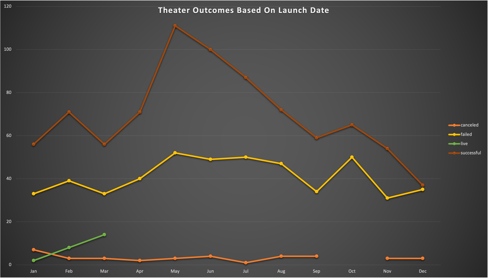
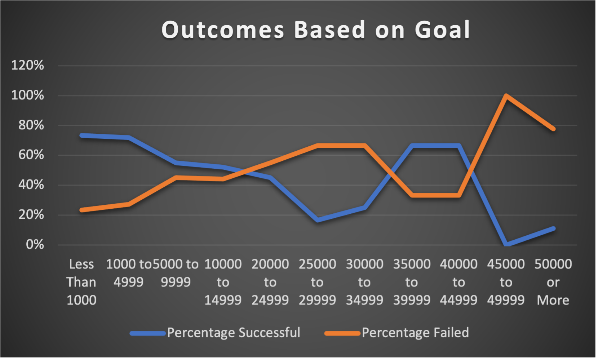

# Kickstarting with Excel Project

## Overview of Project
To know how different campaigns fared in relation to their launch dates and their funding goals. Using the Kickstarter dataset to visualize campaign outcomes based on their launch dates and their funding goals. 
### Purpose
The Purpose of this was to help Louise identify what other campaigns did in relation to their launch dates and funding goals. In order to help Louise I analyzed the data set using  four major components that can be used as a a primary foucs for this analysis. Number one was to find the avaerage amount of funding other plays had listed as a goal. Number two was to look at the amount of funds that were actually given for the plays in the data set. Number three was to see of the plays had a successful outcome by reaching there funding goals. Number four was to look and see if there were any differences with the launch date and its impact on its successfulness for the play. Thus giving Louise a better picture to what would be needed in order for her to in prove her funding for her campaign.   

## Analysis and Challenges

### Analysis of Outcomes Based on Launch Date

In this graph the data displayed shows the x-axis with the month and the y-axis with the total number of campaigns for that month. The graph also highlights if the campaign was either successful, canceled, failed, or live for that month. Within this data set it shows that in a span of a year there had been more successful theater outcomes. It also highlights how a certain month may have an impact on a success of a campaign which shows the ideal month to start funding for a play. Staring from April - September there was a high rate of successful plays funded than from January - March or October - December. Based on this it is safe to say that those campaigns who started their funding goals in May had a higher success rate than any other month. There is a limitation to this date and how it only shows the number of successful campaigns in a month, without any specific details about the play genre. A possible aid to this graph could be creating a chart to see which specific genre had a higher success rate with in that time frame.   

### Analysis of Outcomes Based on Goals

This data is displayed showing how the plays did based on their funding goals for the play. It demonstrates that the higher the funding the higher rate of failure campaigns had. The dip in successful outcomes based on goals starts from the range of $10,000 to about $35,000 where a large number of goals begin to drop their success rates. The graph does show that their low budget goals that had a high rate of success based on funding goals. This range of successful outcomes based on goal started at less than $1,000 - $10,000 mark, there is a limitation how Louise can use this information. She can use this information to show possible funders that her asking funding goal can yield a successful outcome. However, the graph does not show the genre of plays that were successful or which funding campaigns based on location had more of a successful outcome. To better improve the rate of success an ideal location should be pin pointed in order to best analyze the rate of success of a plays funding. By having the data on which location or country has higher successful outcomes based on funding goal would vastly improve the successfulness of the campaign. While also including which genre type of the play that has a higher funding rate in the shortest time would aid in future play success. Although Louises funding campaign was funded for $2,485 the genre may have impacted its failure, in the future having data about successful genres and locations for a play may lead to having a higher succesful campaign in the future. 

### Challenges and Difficulties Encountered
## Challenges
One of the challenges I faced in this project was trying to understand how Louise's broad questions would aid her in creating a successful campaign. Throughout the whole project I felt like in order for her to have a successful campaign she should have been asking different questions. One of the key questions I was thinking about was which genre type has the most successful funding and outcome. In an additional factor I felt would have helped was knowing the age range of the audience, in order to create a successful play based on the target population. One issue I did face was when I created the mean, median, and mode. I kept getting numbers that weren't rounding up, so I solved this by looking back into the modules we covered in order to get a rounded number. Another issue I encounter was trying to use two different machines windows and Mac to work on excel while I was traveling. I started my project on a Mac desktop, I had a traveled to a different location where I had taken my windows laptop. I had saved the worksheet on the windows cloud however there was a formatting error with my data that made me restart the whole assignment. While trying to input some of the formulas on the PC it would buffer and close the program. I was unsure to why this was happening with my Kickstarter data, so I deleted the whole assignment and downloaded a new file to work from. This seemed to solve the issue I had and I was able to process the data to make the graphs. I learned that next time make a saved copy and duplicate my work just in case my system does this again.

## Results

- What are two conclusions you can draw about the Outcomes based on Launch Date?

The frist conclusion is that throughout the year there is a higher rate of succuessful play outcomes based on launch date. With the highest point of success in the month of May having the highest peek for successfulness. Bring me to the conclusion that if Louise should have started her funding in May instead of June she may have had more funding for her play Fever.  

- What can you conclude about the Outcomes based on Goals?

The first conclusion one can draw about the outcomes based on launch date is that the higher the funding the higher rate of failure campaigns had. The Second was that the graph showed that the lower the funding (Less than $5k) the higher success rate the play had. The reason could be because of a lower goal the easier it is to gain funding for vs having a larger funding goal.

- What are some limitations of this dataset?

One of the limitations of these dataset had is that is shows the success a play had based on funding. The dataset did not show how the play performed or if any production resulted in a successful sell out of tickets. Also the dataset does not show any data on how many people attened plays, this information would help create a better anaylsis. The dateset can show how the plays have performed and have successed. 

- What are some other possible tables and/or graphs that we could create?

Another graph that be created is which country had the highest successful outcomes for plays vs failures. A table that can be created showing the difference in funding vs the success rate in all countries. Having a graph showing which genre for a play would also help in creating a better understanding as to which plays do the best. Lastly creating a chart showing an average donation for successfully vs failed plays would be useful information for creating a future campaign. 
